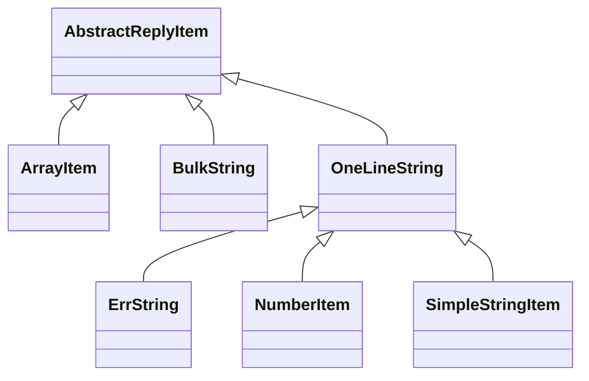

#  C++网络编程之ASIO

## 前言

&emsp;&emsp;是时候熟悉ASIO了. 
&emsp;&emsp;C++20标准库的网络部分将是基于`ASIO`, 已无疑义, 目前唯一的变数只是时间的问题. `networking`的提案**依赖**`executor`的提案, 
&emsp;&emsp;所以只有在`executor`进`C++20`的前提下, `networking`才能同一期进入. 

&emsp;&emsp;WG21(c++标准委员会)将在今年9月22至23两天内(会议排期看这里), 加班加点专门讨论`executor`的提案, 肯定是希望`executor`进入`C++20`, 所以对于网络部分进入`C++20`, 也是可以期待的了. 对于`ASIO`进标准, 是好是坏我觉得不重要, 重要的是标准库中终于有网络相关的库了. 大家都用一样的库, 才能便于交流. 如果每个人都自己造轮子, 含有张三牌轮子的代码给李四用, 使用起来成本会很高. 标准库本身的意义不就是这样么？

&emsp;&emsp;关于`ASIO`的长短优劣众说纷纭, 抱着小马过河的态度, 我决定亲自体验一下, 断断续续看了部分例子和源码, 把之前做的某些网络工具也用`ASIO`重新实现了一遍, 有一些体会. `ASIO`的异步接口非常易用, 配合上`C++11`的`lambda`函数, 用起来相当简单, 写一个像ss那样的fan墙工具也只需要一天的时间, 和go语言的同步+协程模型开发效率相当. 后续我打算发一系列的学习笔记. 

&emsp;&emsp;`ASIO`树大招风, 业界有不少偏见, 亦假亦真, 作为开篇, 我今天想针对这些偏见, 一一发表一下我自己的看法. 据我所知, 偏见主要有这几条: 
* 1  ASIO依赖boost, 讨厌boost的人也无条件讨厌ASIO；
* 2  ASIO内部有锁, 导致牺牲了很多性能；
* 3  ASIO为了跨平台, 将Linux/Darwin系统的`reactor`模式, 封装成了windows系统的`proactor`模式, 对于Linux/Darwin牺牲了性能；
* 4  ASIO很慢, 不如自己裸写epoll；
* 5  不喜欢ASIO的代码;

**先看1**, ASIO依赖boost, 讨厌boost的人也无条件讨厌ASIO；
&emsp;&emsp;我也讨厌boost, 如果ASIO还未脱离boost就不会有这篇文章, 现在`C++11`的编译器使用`ASIO`已经不需要boost了, 编译的时候定义宏`ASIO_STANDALONE`即可, 比如说用g++编译, 采用`g++ -DASIO_STANDALONE ….`

**再看2**, ASIO内部有锁, 导致牺牲了很多性能；
&emsp;&emsp;有锁这个是事实, 以后是多核的天下, 多线程本来就是主流, 作为高性能的库, 以多线程为默认场景这个是可以接受的. 但是在使用`ASIO`时, 如果确定只用单线程, 只要在构造`io_context`时传入参数1, 即可. 像这样; 
```cpp
asio::io_context context(1); // one thread
```
&emsp;&emsp;这是我看源码时发现的, 只要设置了参数1, 所有`lock`和`unlock`都会被if语句跳过, 相当于是无锁. 
&emsp;&emsp;顺便说一下, 不要小看了单线程哦, 异步编程的单线程性能那可是相当之高. 

**再看3**, ASIO为了跨平台, 将Linux/Darwin系统的`reactor`模式, 封装成了windows系统的`proactor`模式, 对于Linux/Darwin牺牲了性能; 
&emsp;&emsp;ASIO采用`proactor`没错. 但是有两点我想说, 首先是使用`ASIO`时, 你依然可以使用`reactor`模式, 其次是我不觉得将linux/darwin的`epoll`/`kqueue`实现成`proactor`让性能下降了. 
&emsp;&emsp;程序员不缺乏偏执狂, linux程序员可能讨厌`proactor`, 觉得`ASIO`居然让linux去迎合windows的套路, 无法接受；而windows程序员觉得linux/mac的`reactor`只是半成品  觉得linux程序员好可怜, 总之就是鄙视链无处不在. 
&emsp;&emsp;采用ASIO如何使用`reactor`模式来编程呢？调用socket类的`async_wait`方法用来等待读或者写事件, 在这个函数的回调函数里面去读或者写, 就是`reactor`模式了！当然我相信应该还有其它方法也能使用`reactor`, 毕竟源码里面相关的类名字就叫`epoll_reactor`  `kqueue_reacto`r等等, 直接拿来用也不是不可能. 
&emsp;&emsp;那再来看性能问题, 是不是linux的epoll封装成`proactor`就会变慢. `reactor`的epoll使用姿势一般是这样; 程序监听读  写事件, 事件到来以后系统会通知程序去调用read/write等函数进行读写数据；`ASIO`封装成`proactor`以后变成了这样; 程序需要读数据时, 将收取数据的buffer传给`ASIO`, `ASIO`监听读事件, 在事件到来时帮你调用`read`函数, 存到你的buffer里面, 然后再告诉你; 读到数据了, 需要写数据时情况类似. 
&emsp;&emsp;可见, `reactor`和`proactor`唯一的区别是read/write这些系统调用到底是由`ASIO`库去调用  还是自己写的函数调用, 根本没有本质的区别, 所以说牺牲性能也是无中生有. 
&emsp;&emsp;(`proactor`对于每个scoket一般需要2个buffer, 一万个socket就需要2w个buffer, 比较浪费内存. `reactor`在这一点上面有一些些优势. 对于某些场合的应用, 不管多少socket, 可能只需要少许几个buffer即可. 但是在实战中, 因为需要考虑tcp分包的问题, 每次socket都需要将不满一个数据包的内容暂存起来, 每次发送也不见得能一次发完同样需要将剩余数据存起来下次再发, 所以依然需要2个buffer, 和`proactor`没区别. )

**再看4**; ASIO很慢, 不如自己裸写epoll
&emsp;&emsp;这个我承认, 因为我自己就喜欢裸写epoll. 但是ASIO集成了很多特性, 如果你自己想去用epoll实现类似的功能, 肯定是要增加更多的类  每个类增加更多的成员变量  更多的成员函数, 对象拷贝代价变大  函数调用次数变多, 这样一来, 性能有所下降不是正常的事情么？
&emsp;&emsp;以后有空我会去压测一下, 看看ASIO比裸写的epoll到底慢多少, 到时候回来更新内容, 我觉得慢10%以内我都能接受. 至少会压到几十万连接吧, 暂时手头上没足够机器. 

**继续看5**; 不喜欢ASIO的代码
&emsp;&emsp;其实C++标准只是规定了接口（名字空间  类名  函数名  参数个数及其类型等等）以及相关算法的复杂度, 每个编译器到时候都会有自己的实现. 可以这么认为; 标准库中的实现代码质量应该优于(至少等于)ASIO  性能高于(至少等于)ASIO. 而且, 标准库中也看不到ASIO这个单词, 到时候只有std::net名字空间, 不存在asio名字空间, 所以, 不管是什么原因对于ASIO无法接受的, 可以休矣. 
&emsp;&emsp;只有抛弃偏见  拥抱变化, 才能愉快地学习  提高. 关于ASIO学习笔记的第一篇, 内容就到这里了. 快来一起愉快地学习ASIO吧. 希望以后能够持续更新. 因为是学习笔记, 所以难免会有纰漏, 欢迎大家批评指正,  对于确认之后的内容我会更新到文章的正文中. 

## 源码阅读

&emsp;&emsp;这段时间抽空继续在学习asio的相关知识, 按照三千字每篇的篇幅, 感觉可以接着写好几篇了. 最好的学习方法就是分享, 后面打算持续分享asio相关内容. 

|  asio::io_context     | asio::ip::tcp::socket   | acceptor::async_accept   | asio::async_read       |
| --------------------- | ----------------------- | ------------------------ | ---------------------- |
| asio::io_context::run | asio::ip::tcp::acceptor | socket::async_read_some  | asio::async_read_until |
| asio::buffer          | asio::ip::tcp::endpoint | socket::async_write_some | asio_async_write       |


&emsp;&emsp;`ASIO`的源码阅读起来有点困难, 采用了太多的宏与模板, 并且还有些代码是为了兼容以前的老版本而存在的, 有点干扰视线. 我大致浏览了一下, 也作了一些初步的笔记, 主要感受有2点: 
* 1  库中的很多代码都采用了多重继承+模板特化的方法, 作者的功底很深, 是一个值得学习的好库. 更为强大的是, 我目前发现除了最底层的`kqueue_reactor`/`epoll_reactor`/`win_iocp_io_context`等这几个类以外, 其它的所有功能都是可以被定制的, 而且不少功能的定制方法还不止一种. 扩展方法主要有模板特化  从现有类继承  提供自定义的函数对象等等. 就冲着如此强大的扩展性, 进入C++标准库就实至名归了. 
* 2  asio的源码是跨平台多线程编程的经典例子. 多线程编程其实有不少坑, asio内部的实现用到了多线程编程的各种特性, 对学习多线程编程很有用. 关于多线程我的经验不多, 鉴于单线程异步编程的强大性能对于大部分的人都已经足够, 我后面的例子都会以单线程为主. 多线程的模式可能会放在最后的章节. 由于我本身是做服务器的, 一般会选用多进程而不是多线程. 

### 同步和异步
&emsp;&emsp;`ASIO`也提供了同步编程的方法, 但是同步的学起来很简单, 不需要啥教程, 而且同步的使用场景相对来说比较狭窄, 所以我后面只举异步编程的例子. 

### 基础类和函数
&emsp;&emsp;`ASIO`的库包含了很多类和函数, 作为一般的应用, 只要掌握常用的几个即可, 列举如下. 

```cpp
asio::io_context // 基础设施, 可以看作事件循环. socket  timer都需要它. 
                 // io_context可以作为应用程序唯一的事件循环, 
                 // 也可以很容易地与qt等现有的event loop集成. 

    asio::io_context::run()  // 成员函数 运行事件循环. 
```
```cpp
asio::ip::tcp::socket    // tcp socket类

    socket::async_read_some  // 成员函数 接收一次数据, 收到多少是多少.
    socket::async_write_some // 成员函数 发送一次数据, 需要发的数据未必一次就可以发完.
```
```cpp
asio::ip::tcp::acceptor  // tcp服务器用来接受客户端连接的类

    acceptor::async_accept // 成员函数  接受一个连接. 注意只有一个. 
                           // 如果要接受多个, 在回调函数中再次调用此函数. 
```
```cpp
asio::ip::tcp::endpoint  // tcp 地址+端口, 用作参数
```
```cpp
asio::buffer 系列类      // buffer, 用来缓存需要收发的数据. 
                         // buffer相关的类是asio中功能非常独立的部分, 和其它的功能交集不多, 
                         // 所以掌握起来最为简单. 
```
```cpp
asio::async_read         //     全局函数 读取指定字节数的数据. 
                         // 这个函数是asio对socket.async_read_some的高级封装, 
                         // 在很多场合用这个函数可以节省很多代码. 
asio::async_read_until   // 全局函数 读取数据直到满足某个条件为止. 
asio::async_write        // 全局函数 发送指定字节的数据, 直到发完为止. 
```

&emsp;&emsp;本节未介绍udp相关的类. 实际上, udp在不少场合的表现远优于tcp, 而且已经有各种可靠udp的实现. 异步编程还有一个很重要的设施就是`timer`, 即定时器, 关于`timer`后面再介绍. `ASIO`的定时器管理采用的是堆结构, 复杂度为O(logN), 效率较低, 实测每秒处理5万个左右. 
&emsp;&emsp;前面提到了, `ASIO`的可扩展性极高, 对于定时器的管理, 也可以用自定义的类. 大量的定时器可以采用一种叫做时间轮的数据结构来实现, 复杂度为O(1). 

### asio相关的C++知识
&emsp;&emsp;使用`ASIO`需要熟悉C++11的`lambda`  `std::function`以及智能指针`std::shared_ptr`  `std::enable_shared_from_this`等. 

### asio初步实践
&emsp;&emsp;最后来写一个http服务器. http服务器是学习网络编程的好素材. http协议的文档很全, 且主要是使用文本协议, 测试简单, 用浏览器就可以测试. http协议不仅仅只能用来做web服务器, 也可以直接拿来在项目中作为通信协议, 比如说网络游戏也可以直接用http协议. 
&emsp;&emsp;http服务器的编程具有下限低上限高的特点, 非常适合用来作为学习编程的素材. 所谓的下限低是指几分钟就能写一个, 上限高是指如果要打磨  完善  优化可能需要几年的时间. 用C写的极简http服务器只需要200行代码, [这里就有一个](https://blog.abhijeetr.com/2010/04/very-simple-http-server-writen-in-c.html). 用`ASIO`来实现一个类似的只要100行以内. 我的实现如下. 

```cpp
#include <iostream>
#include <string>
#include <memory>
#include "asio.hpp"

using namespace std;

class HttpConnection: public std::enable_shared_from_this<HttpConnection> {
public:
    HttpConnection(asio::io_context& io): socket_(io) {}

    void Start() {
        auto p = shared_from_this();
        asio::async_read_until(socket_, asio::dynamic_buffer(request_), "\r\n\r\n"
                                , [p, this](const asio::error_code& err, size_t len) 
        {
            if (err) {
                cout<<"recv err:"<<err.message()<<"\n";
                return;
            }
            string first_line = request_.substr(0, request_.find("\r\n")); // should be like: GET / HTTP/1.0
            cout<<first_line<<"\n";
            // process with request
            // ...

            char str[] = "HTTP/1.0 200 OK\r\n\r\n"
                "<html>hello from http server</html>";
            asio::async_write(socket_, asio::buffer(str)
                                , [p, this](const asio::error_code& err, size_t len) 
            {
                socket_.close();
            });
        });
    }

    asio::ip::tcp::socket& Socket() { return socket_; }
private:
    asio::ip::tcp::socket socket_;
    string request_;
};

class HttpServer {
public:
  HttpServer(asio::io_context& io, asio::ip::tcp::endpoint ep): io_(io), acceptor_(io, ep) {}

    void Start() {
        auto p = std::make_shared<HttpConnection>(io_);
        acceptor_.async_accept(p->Socket()
                                , [p, this](const asio::error_code& err) 
        {
            if(err) {
                cout<<"accept err:"<<err.message()<<"\n";
                return;
            }
            p->Start();
            Start();
        });
    }
private:
    asio::io_context& io_;
    asio::ip::tcp::acceptor acceptor_;
};

int main(int argc, const char* argv[]) {
    if(argc != 3) {
        cout<<"usage: httpsvr ip port\n";
        return 0;
    }

    asio::io_context io;
    asio::ip::tcp::endpoint ep(asio::ip::make_address(argv[1]), std::stoi(argv[2]));
    HttpServer hs(io, ep);
    hs.Start();
    io.run();
    return 0;
}
```
&emsp;&emsp;`async_xxx`函数的回调函数是`ASIO`里面的一个重要部分, 叫做Completion handler, 后面打算专门介绍. 这次的代码很少, 我全部贴这里了. 以后代码较多的时候就放在github上. 


## 用法

&emsp;&emsp;`asio::post`是线程安全的, 使用起来很简单, asio系列文章的第三篇结合一个自己实现的redis client来展示其用法；状态机是网络编程中协议解析常用的工具, 这里也简单展示一下. 

&emsp;&emsp;`redis`是一个流行的数据库, 过去几年获得了巨大的成功, 当下互联网很多编程语言的技术栈都包含了它. redis的协议基于文本格式, 人肉可读性很好, 因为`redis`的流行, 很多服务程序都支持redis格式的协议. 

&emsp;&emsp;在网络编程时, 对于协议的解析可以采用状态机的思想. 状态机的全名叫有限状态机(finite state machine), 简称fsm, 知乎上面关于fsm的话题很少, 有兴趣的可以自己研究, 简单的fsm可以理解为一个用来表示状态的变量(一般是int  bool  enum类型)加上一堆`switch...case`或一些`if...else`语句. 我这里演示采用fsm+面向对象的方法来解析redis的协议, 现实起来简单清晰. 

&emsp;&emsp;redis的安装非常简单, mac和linux都可以一键安装, 知乎上面关于redis的话题非常多, 这里就不介绍了. redis有一个命令行client和一组C语言的api, 我这里用`ASIO`来实现一个c++的api, 然后再用对应的api实现一个类似的命令行客户端. 

&emsp;&emsp;因为调用`std::cin`的时候会阻塞, 标准库中没有异步`iostream`的api, 我不想引入太多第三方库, 所以对于用户的输入专门放在一个线程中, 将`ASIO`的接收和发送数据放在另一个线程中. `ASIO`对于对线程的支持极好, 很多时候不需要自己加锁, 可以刚好借这个例子演示一下. 

&emsp;&emsp;[相关的代码在这里](https://github.com/franktea/network/tree/master/redis-asio)

&emsp;&emsp;只需要安装`cmake`和支持`c++11`的编译器, 把整个network取下来即可: 
```bash
git clone --recursive https://github.com/franktea/network.git
cd network
mkdir -p build
cd build
cmake ..
make
```
&emsp;&emsp;这样就可以编译整个目录, 我前阵子学习`ASIO`的例子都在这里面. 我只在mac/linux下面编译过, windows里面如果有警告可以自己处理一下. 

&emsp;&emsp;redis的协议非常简单, 文档几分钟就可以看完, [在这里](https://redis.io/topics/protocol), 格式共分为5种
1. 以+开头的简单字符串Simple Strings；
2. 以-开头的, 为错误信息Errors；
3. 以:开头的, 为整数Integers；
4. 以$开头的, 表示长度+字符串内容的字符串, redis叫它Bulk Strings；
5. 以*开头的, redis协议里面叫Arrays, 表示一个数组, 是上面多种元素的组合. Arrays是可以嵌套的, 相当于一个树状结构, 前面四种格式都是叶子节点, Arrays是非叶子节点. 

&emsp;&emsp;对于请求协议, 全部打包成多Arrays格式即可. 比如说`set aaa bbb`, 打包成: `*3\r\n$3\r\nset\r\n$3\r\naaa\r\n$3\r\nbbb\r\n`. 从命令行中获得输入, 然后转换成对应的格式, 这种转换只需要写一个很简单的类即可搞定. 对于redis的回包, 则可能包含5种协议的若干种, 需要每种都能解析, 因为有5种, 所以定义一个父类AbstractReplyItem, 然后对于每种具体的协议实现一个子类. 我的实现类图如下 :


&emsp;&emsp;其中有3种协议都只有一行, 所以定义了一个中间的父类OneLineString. AbstractReplyItem用一个工厂方法, 创建对应的子类: 

```cpp
std::shared_ptr<AbstractReplyItem> AbstractReplyItem::CreateItem(char c) {
    std::map<char, std::function<AbstractReplyItem*()>> factory_func = {
           {'*', []() { return new ArrayItem; } },
           {'+', []() { return new SimpleStringItem; } },
           {'-', []() { return new ErrString; } },
           {':', []() { return new NumberItem; } },
           {'$', []() { return new BulkString; } },
    };

    auto it = factory_func.find(c);
    if(it != factory_func.end()) {
           return std::shared_ptr<AbstractReplyItem>(it->second());
    }

    return nullptr;
}
```
&emsp;&emsp;在解析回包时, 调用Feed函数, 每次解析一个字符, 在单元测试的`response_parser_test.cpp`中也可以看到其用法. 
&emsp;&emsp;上面简单地说了一下解析协议的类的结构, 现在来看看如何用状态机进行解析. 以OneLineString为例, 该类解析前面5中格式中的以 `+`  `-`  `:`三种字符开头的回包协议, 例如: 

``` plantext
"+OK\r\n"
"-Error message\r\n"
":456789\r\n"
```
&emsp;&emsp;最前面一个字符用来标识协议的种类, 最后一个`\r\n`表示解析完毕, 对于这几种只有一行文本的协议, 我定义了2个状态: 

```cpp
enum class OLS_STATUS { 
    PARSING_STRING,
    EXPECT_LF // got \r, expect \n
};
```

&emsp;&emsp;用enum来定义意义更清晰, 其实用int也可以. PARSING_STRING表示正在解析文本, 如果碰到`\r`, 就变成`EXPECT_LF`状态, 表示接下来必须是`\n`. 

&emsp;&emsp;在OneLineString中只有两种状态的状态机, 这应该是全世界最简单的状态机了, 其实只要用一个`if...else`就可以实现. 在解析Arrays的时候, 就需要更多种状态才可以描述了. Arrays格式的一个例子如下: 
```plantext
*5\r\n
:1\r\n
:2\r\n
:3\r\n
:4\r\n
$6\r\n
foobar\r\n
```

&emsp;&emsp;首先要解析`*`后面的数字, 这个数字就是对应子协议的条数, 上面这个例子的条数为5, 然后再依次解析每条子协议. 我定义了4种状态: 
```cpp
enum class AI_STATUS { 
    PARSING_LENGTH,
       EXPECT_LF,               // parsing length, got \r, expect \n
       PARSING_SUB_ITEM_HEADER, // expect $ + - :
       PARSEING_SUB_ITEM_CONTENT
};
```
&emsp;&emsp;可见, 所谓的状态机就是定义一组状态, 然后根据输入事件(在解析协议的时候输入事件就是一个个的字符)和当前状态, 进行不同的处理, 处理的时候可能发生状态切换. 四种状态机也不算非常复杂, 想关的实现可以直接看github上的代码, 关于状态机这里就不多说了. 

&emsp;&emsp;解析协议相关的类实现以后, 就可以用asio来实现client api了, 有了client api, 就可以拿来发送redis的请求了. `general-client.cpp`里面实现了一个非常简单的client类, 叫OneShotClient, 每个实例只发送-接受一次请求, 用完即销毁, 多个请求就要创建多个实例, 这种方法比较适合短链接. 

&emsp;&emsp;在`multi-thread-client.cpp`里面我实现了一个和redis-cli类似的一个命令行工具.  在main函数里面创建了两个线程, 一个线程(主线程)用来从命令行读取数据, 然后将数据发送到asio数据收发的线程, 发送数据的代码如下: 
```cpp
void Send(const string& line) {
    auto self = shared_from_this();

    // 此函数会在io_context::run的线程中执行
    asio::post(io_context_
            , [self, this, line]() 
    { 
        requests_.push_back(line); // 将数据放入队列
        SendQueue(); // asio从队列里面取出数据发送给redis 
    });
}
```
&emsp;&emsp;调用`asio::post`, 不需要加锁, post参数中lambda函数是在另一个线程中执行的. 注意一下, 需要发送的数据`const string& line`, 在Send函数里面传的是引用, 可以避免一次拷贝, 但是在将其post到另一个线程中时, 传的是拷贝(lambda中捕捉用的是line而不是&line), line被拷了一份, 其生命周期和原来的参数就无关了. 多线程编程重要的就是搞清楚对象的生命周期, 避免出现空悬指针的情况. 

&emsp;&emsp;asio对多线程支持很好, 一般情况都不需要自己加锁, 有`asio::strand`可以用实现常用的同步. 在这个redis-client的例子中, 主线程负责读取用户输入, 另一个线程调用`ASIO`的收发函数, 收到数据并输出到`std::cout`中, 严格地说, 也是需要同步的, 为了简单, 我没做同步. 

&emsp;&emsp;但是在`io_context`目录中, 演示了`asio::strand`的用法: 

```cpp
asio::io_context io; 
asio::strand<asio::io_context::executor_type> str(io.get_executor()); 
```

## reactor模式与libcurl
&emsp;&emsp;`ASIO`用的是`proactor`模式, 于是`reactor`的粉丝就对`ASIO`无脑黑. 其实`ASIO`功能很强大, 直接支持`reactor`模式, 满足各种不同强迫症玩家的胃口. 

&emsp;&emsp;想要使用`reactor`模式, 只需要调用下面两个函数: 
```cpp
socket::async_wait(tcp::socket::wait_read, handler)
socket::async_wait(tcp::socket::wait_write, handler)
```
&emsp;&emsp;在handler回调函数里面亲自调用read/write读写数据, 与其它所有支持`reactor`的网络框架的用法如出一辙. 

&emsp;&emsp;handler回调函数的格式如下: 
```cpp
void handler(const asio::error_code& error);
```
&emsp;&emsp;以读取数据为例, 可以定义类似如如下格式的回调函数 . 这里需要用到`native_handle()`函数, 这个函数返回socket封装的底层的`socket fd`. 
```cpp
void Session::read_handler(const asio::error_code& error) {
    if(!error) {
        int n = ::read(socket_.native_handle(), buffer_, sizeof(buffer_);
        //……
    }
}
```

&emsp;&emsp;就这样, `reactor`模式的用法就已经演示完了. 其实, 为了使用`reactor`而使用`reactor`, 在asio的世界里面是没有前途的. 那啥时候必须要使用呢？答案就是: 配合第三方软件的时候. 现在以asio+libcurl的用法, 来诠释`ASIO`的`reactor`模式的应用场合. 

&emsp;&emsp;libcurl是一个功能极为强大的客户端网络库, 无论是想做一个网络爬虫, 还是想用c++去访问隔壁项目组提供的http服务, libcurl都是一个不二的选择. 但是libcurl的文档比较晦涩, 网上很多教程也都是盲人摸象, 自说自话, 想要真正用起来, 需要费一番周折. 

&emsp;&emsp;关于asio+libcurl的例子, 目前能找到的例子都很老, 而且有些bug, 我这篇文章[相关的代码](https://github.com/franktea/network/blob/master/asio_libcurl/asio-libcurl.cpp), 可以作为较新的参考. 

&emsp;&emsp;[关于libcurl结合外部eventloop的文档](https://ec.haxx.se/libcurl-drive-multi-socket.html). 根据该文档所说, 该用法的重点是二个回调函数, 一个是在某个socket需要关注的事件（可读  可写）发生变化时的回调函数, 另一个是在libcurl关注的超时发生变化时的回调函数. 但是如何结合`ASIO`来使用, 还有其它不少需要注意的地方. 之前写过epoll+libcurl, 这次重新写asio+libcurl, 发现各有优缺点, 当然理解也更深了一些. 

&emsp;&emsp;关于libcurl的各种坑, 在这里不详细介绍了, 有兴趣的可以去github直接看我的代码. 

## 在asio中使用协程
&emsp;&emsp;在前不久关于C++20特性的最后一次会议上, `coroutine ts`终于通过投票. 在语法上来说, 协程的内容主要包括三个新的关键字: `co_await`, `co_yield` 和 `co_return`, 以及std命名空间（编译器的实现目前还是在`std::experimental`）中的几个新类型: 
```cpp
coroutine_handle<P>  coroutine_traits<Ts...>  suspend_always  suspend_never
```

&emsp;&emsp;这些功能其实相当于实现协程的”汇编语言“, 用起来很麻烦, 它们主要是给库的作者使用的, 比如说asio网络库的作者, 用它来给asio加上协程的支持功能. 

&emsp;&emsp;面向大众的协程日常功能需要再提供一套辅助的程序库, 比如说`std::generator`  `std::task` 之类的, 只不过C++20的功能已经冻结了, 在C++20中已经来不及加进去了, 指望std中提供这套库估计需要到C++23才会有. 但是github上面已经有了cppcoro库, 可以先使用它, 当然也可以自己实现, 实现方法参考cppcoro. 

&emsp;&emsp;`ASIO`中早就提供了对于`coroutine ts`的支持, 而且在asio中使用协程相当简单. asio通过提供co_spawn函数来启动一个协程, 而且asio的每个异步函数都有支持协程的重载版本, 可以直接通过co_await来调用, 使用起来就像在写同步程序一样. asio/src/examples/cpp17/coroutines_ts目录中有几个如何使用协程的例子, 因为采用了协程的程序本身可读性非常好, 只要按照这些例子就可以写出自己的协程程序出来. 这个目录中已经有echo_server了, 我们编译它, 以它为服务器, 自己来写一个客户端. 直接命令行编译: 

```bash
clang++ -std=c++2a -DASIO_STA_ALONE -fcoroutines-ts -stdlib=libc++ -I../../../../../../asio/asio/include echo_server.cpp
```
&emsp;&emsp;现在来用协程做一个客户端, 客户端只有一个tcpsocket, 使用一个协程即可, 在此协程中异步连接, 然后异步写数据, 然后再异步读数据, 实现如下: 
```cpp
awaitable<void> Echo() {
    auto executor = co_await this_coro::executor;
    tcp::socket socket(executor);
    co_await socket.async_connect({tcp::v4(), 55555}, use_awaitable); // 异步执行连接服务器
    for(int i = 0; i < 100; ++i) { // echo 100次

        char buff[256];
        snprintf(buff, sizeof(buff), "hello %02d", i);
        size_t n = co_await socket.async_send(asio::buffer(buff, strlen(buff)),  use_awaitable); // 异步写数据
        //assert(n == strlen(buff));
        n = co_await socket.async_receive(asio::buffer(buff), use_awaitable); // 异步读数据
        buff[n] = 0;
        std::cout << "received from server: " << buff << "\n";
    }
}
```

&emsp;&emsp;echo client的功能就实现完了, 看起来确实和写同步程序一样简单. 接下来只要在`main`函数中利用asio提供的`co_spawn`函数启动这个协程即可: 
```cpp
int main() {
    asio::io_context ioc(1);
    co_spawn(ioc, Echo, detached);
    ioc.run();
    return 0;
}
```
&emsp;&emsp;代码在github上. 编译运行, 会输出100行类似`received from server: hello **`的字符串. 输出100行以后, 协程函数执行完成了, `main`函数中的`ioc.run`也返回, 整个客户端也退出了. 

&emsp;&emsp;`co_spawn` 可以在循环中使用, 启动多个并行的协程, 也可以嵌套使用, 在协程中再启动新的协程, asio的所有异步功能都可以用协程. asio未能进入C++20, 协程功能没有早日定案也是其中的原因之一. 现在协程已经落地了, asio会在接下来的时间内好好整理关于对于协程和 `executor` 的支持, 到时候以更合理更优雅更高效的方式加入到`C++23`. 
